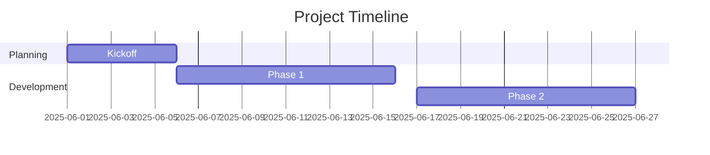
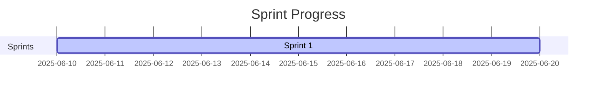
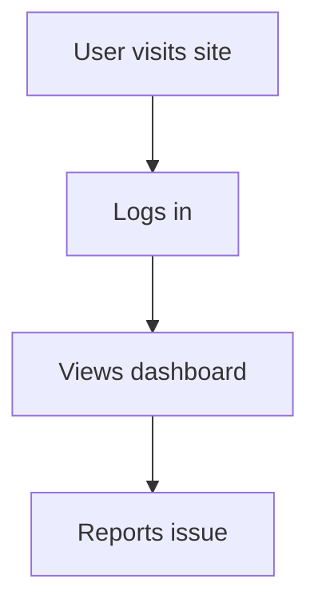

# LiaScript Demo for Project Managers

> A showcase of how project managers can use LiaScript to streamline onboarding, communication, and continuous improvement.

---

## 🧭 1. Interactive Onboarding

Welcome to the project! Please go through the sections below to get oriented.

### 👋 Welcome Message
> Hi! We're excited to have you on the team.

[](https://vimeo.com/1081988681/d0f9cdd659?share=copy)

### 🧩 Your First Week Checklist

- [ ] Meet with your team lead
- [ ] Set up accounts: Slack, GitHub, JIRA
- [ ] Review the [project charter](https://example.com)
- [ ] Read our coding standards

### ❓ Quick Quiz
What tool do we use for task tracking?

- [ ] Trello
- [x] JIRA
- [ ] Asana

---

## 🗂️ 2. Project Kickoff Guide

### 🚀 Goals & Scope
This project aims to modernize the internal analytics dashboard and streamline reporting.

### 📍 Milestones (Gantt Chart)


### 📣 Stakeholders
- Product Owner: Jane Doe
- Dev Lead: Sam Devlin

### 📝 Feedback
[comment]
What are your thoughts or concerns after this kickoff?
[/comment]

---

## 📊 3. Project Status Dashboard

### ✅ Deliverables

- [x] Kickoff Complete
- [ ] Sprint 1 Demo
- [ ] UAT Approval

### 📈 Timeline



### 🚧 Blockers

[comment]
Any current blockers or dependencies?
[/comment]

---

## 🔁 4. Team Retrospective

### 🙌 What went well?
[comment]
Add your thoughts here.
[/comment]

### 😬 What didn’t go well?
[comment]
Share opportunities for improvement.
[/comment]

### 💡 What should we try next time?
- [ ] Pair programming
- [ ] More async check-ins
- [ ] Shorter sprint planning

### 🗳️ Poll: Top Priority for Next Sprint

[poll]
- Improve QA process
- Reduce meeting time
- Enhance documentation
[/poll]

---

## 📘 5. Knowledge Sharing / SOP

### 🧪 How We Deploy Code

1. Merge PR into `main`
2. GitHub Actions runs tests
3. Deployment is triggered via CI/CD
4. Slack notification is sent

```bash
git checkout -b feature/your-branch
git commit -m "Add new feature"
git push origin feature/your-branch
```

### 🧠 Check Your Understanding

- [ ] Do you understand the merge process?
- [ ] Are you added to the Slack #deploy channel?

---

## 🧠 6. Agile & HCD Workshop

### 🎨 Design Studio Instructions

1. Review the problem statement.
2. Use Miro or whiteboard tool to sketch ideas.
3. Return here to upload or link your ideas.

[iframe Miro Example](https://miro.com)

### 📌 Journey Map



[comment]
What user experience challenges do you see in this journey?
[/comment]

---

## ✅ Thanks for Viewing the Demo

LiaScript helps PMs:
- Create interactive, living documents
- Centralize planning and documentation
- Facilitate team collaboration and feedback

Try editing this file on GitHub or GitLab and integrate it into your workflow!
